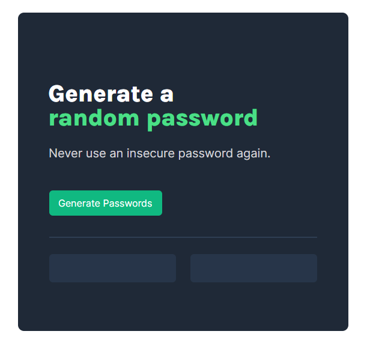

# Random Password Generator
This is a Random Password Generator Solo Project whic is the part of Frontend Developer Career Path as Scrimba. The aim of the project was to create app which generates random passwords

To do this project you need a basic understanding of HTML, CSS, Javascript and principles of responsive web design.

# Buid With
- HTML
- CSS
- Javasript
- Visual studio code
- Responsive Web Design

## Overview

### screenshot

## Links
- [Solution](https://github.com/Dachi-Papashvili88/random-password-generator)
- [Live](https://dachi-papashvili88.github.io/random-password-generator/)

